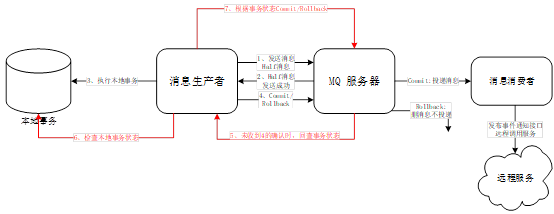

#SpringMvc整合rocketmq示例
##1、前言
随着各公司服务越来越复杂，数据量越来越多，慢慢的公司就引入了微服务以及分库分表等技术，这些技术的确非常的有用，但是在解决事务方面带来了一些问题。
分布式事务，我们一般都是强调的最终一致性，而不是强一致性！！！
主要概括为3类：
基于单个JVM，数据库分库分表了（跨多个数据库）。
基于多JVM，服务拆分了（不跨数据库）。
基于多JVM，服务拆分了 并且数据库分库分表了。
正是为了解决上面的3类问题，才引入了分布式事务相关的技术来解决这些问题
目前市面上消息中间件只有rocketmq支持分布式事务，但是在版本的迭代中，阿里在最新4.3版本对其相关插件进行了完善，那这里我们就要介绍rocketmq的分布式事务的实现

##2、介绍
分布式事务解决方案有很多，本篇下面需要说的RocketMQ事务消息仅仅是其中的一种解决方案。
Half(Prepare) Message
指的是暂不能投递的消息，发送方已经将消息成功发送到了 MQ 服务端，但是服务端未收到生产者对该消息的二次确认，此时该消息被标记成“暂不能投递”状态，处于该种状态下的消息即半消息。
消息回查
由于网络闪断、生产者应用重启等原因，导致某条事务消息的二次确认丢失，MQ 服务端通过扫描发现某条消息长期处于“半消息”时，需要主动向消息生产者询问该消息的最终状态（Commit 或是 Rollback），该过程即消息回查。

执行流程图如下： 

1.	发送方向 MQ 服务端发送消息。
2.	MQ Server 将消息持久化成功之后，向发送方 ACK 确认消息已经发送成功，此时消息为半消息。
3.	发送方开始执行本地事务逻辑。
4.	发送方根据本地事务执行结果向 MQ Server 提交二次确认（Commit 或是 Rollback），MQ Server 收到 Commit 状态则将半消息标记为可投递，订阅方最终将收到该消息；MQ Server 收到 Rollback 状态则删除半消息，订阅方将不会接受该消息。
5.	在断网或者是应用重启的特殊情况下，上述步骤4提交的二次确认最终未到达 MQ Server，经过固定时间后 MQ Server 将对该消息发起消息回查。
6.	发送方收到消息回查后，需要检查对应消息的本地事务执行的最终结果。
7.	发送方根据检查得到的本地事务的最终状态再次提交二次确认，MQ Server 仍按照步骤4对半消息进行操作。
事务消息发送对应步骤1、2、3、4，事务消息回查对应步骤5、6、7。

##3、准备
项目结构

     父项目:spring-rocketmq-parent

     子项目：基础配置包-springmvc-rocketmq-common
            生产者包-springmvc-rocketmq-producer
            消费者包-springmvc-rocketmq-consumer

##4、正文
pom.Xml核心依赖

这里要用4.3.0版本的rocketmq基础jar。
````xml
<dependency>   
    <groupId>org.apache.rocketmq</groupId>  
    <artifactId>rocketmq-client</artifactId>   
    <version>4.3.0</version>   
</dependency>

````
###4.1、基础配置介绍
我们在项目springmvc-rocketmq-common中进行rocketmq生产者、消费者的初始化配置，
然后提供给具体的依赖者进行调用。下面我们来具体介绍相关配置。

####普通消息生产者配置：DefaultMQProducerAutoConfiguration
作用：用于初始化配置普通消息生产者的一些参数。代码如下：
````java
/**
 * @author Zhuiqiuf
 * RocketMQ普通消息生产者初始化自动装配
 */
@Data
@Component
public class DefaultMQProducerAutoConfiguration {

    private DefaultMQProducer defaultProducer;

    /**地址列表，多个NameServer地址用分号隔开*/
    private String namesrvAddr;

    /**客户端实例名称，客户端创建的多个Producer,Consumer实际是公用一个内部实例（这个实例包含网络连接，线程资源等）*/
    private String instanceName;

    /**
     * Producer组名，多个Producer如果属于一个应用，发送同样的消息，则应该将他们归为同一组
     */
    private String producerGroup="DEFAULT_PRODUCER";
    /**
     * Broker回查Producer事务状态时，线程池大小
     */
    private Integer checkThreadPoolMinSize;
    /**
     * Broker回查Producer事务状态时，线程池大小
     */
    private Integer checkThreadPoolMaxSize = 1;
    /**
     * Broker回查Producer事务状态时，Produceer本地缓冲请求队列大小
     */
    private Integer checkRequestHoldMax = 2000;

    /**
     * 消息最大大小，默认4M
     */
    private Integer maxMessageSize=1024*1024*4;
    /**
     * 消息发送超时时间，默认3秒
     */
    private Integer sendMsgTimeout=3000;
    /**
     * 消息发送失败重试次数，默认2次
     */
    private Integer retryTimesWhenSendFailed=2;

    /**
     * vip通道
     */
    private boolean vipChannelEnabled=false;


    /**
     * 初始化向rocketmq发送普通消息的生产者
     */
    //@Bean
    //@Conditional(ProducerConditional.class)
    public void init() throws MQClientException {
        /**
         * 一个应用创建一个Producer，由应用来维护此对象，可以设置为全局对象或者单例<br>
         * 注意：ProducerGroupName需要由应用来保证唯一<br>
         * ProducerGroup这个概念发送普通的消息时，作用不大，但是发送分布式事务消息时，比较关键，
         * 因为服务器会回查这个Group下的任意一个Producer
         */
        defaultProducer = new DefaultMQProducer(producerGroup);
        defaultProducer.setNamesrvAddr(namesrvAddr);
        defaultProducer.setInstanceName(instanceName);
        defaultProducer.setVipChannelEnabled(vipChannelEnabled);
        defaultProducer.setMaxMessageSize(maxMessageSize);
        defaultProducer.setSendMsgTimeout(sendMsgTimeout);
        //如果发送消息失败，设置重试次数，默认为2次
        defaultProducer.setRetryTimesWhenSendFailed(retryTimesWhenSendFailed);

        /**
         * Producer对象在使用之前必须要调用start初始化，初始化一次即可<br>
         * 注意：切记不可以在每次发送消息时，都调用start方法
         */
        defaultProducer.start();
    }
    /**
     * Spring bean destroy-method
     */
    public void destroy() {
        defaultProducer.shutdown();
    }
}
````
注释都有相关说明，这里就不赘述了。
####事务消息生产者配置:TransactionMQProducerAutoConfiguration
作用：用于初始化配置事务生产者相关属性，代码如下：
````java
/**
 * @author Zhuiqiuf
 * RocketMQ事务消息生产者初始化自动装配
 */
@Slf4j
@Component
@Data
public class TransactionMQProducerAutoConfiguration {

    private TransactionMQProducer transactionMQProducer;

    /**地址列表，多个NameServer地址用分号隔开*/
    private String namesrvAddr;

    /**客户端实例名称，客户端创建的多个Producer,Consumer实际是公用一个内部实例（这个实例包含网络连接，线程资源等）*/
    private String tranInstanceName;

    /**
     * Producer组名，多个Producer如果属于一个应用，发送同样的消息，则应该将他们归为同一组
     */
    private String producerGroup="DEFAULT_PRODUCER";
    /**
     * 消息发送线程核心线程数
     */
    private Integer checkThreadPoolMinSize=2;
    /**
     * 消息发送线程最大线程数
     */
    private Integer checkThreadPoolMaxSize = 5;
    /**
     * 消息发送线程最大线程数阻塞队列最大数
     */
    private Integer checkRequestHoldMax = 2000;

    /**
     * 消息发送线程超时时间
     */
    private Integer keepAliveTime=100;

    /**
     * 消息最大大小，默认4M
     */
    private Integer maxMessageSize=1024*1024*4 ;
    /**
     * 消息发送超时时间，默认3秒
     */
    private Integer sendMsgTimeout=3000;
    /**
     * 消息发送失败重试次数，默认2次
     */
    private Integer retryTimesWhenSendFailed=2;

    /**
     * vip通道
     */
    private boolean vipChannelEnabled=false;


    /**
     * 初始化向rocketmq发送事务消息的生产者
     */
    public void init() throws MQClientException{
        /**
         * 一个应用创建一个Producer，由应用来维护此对象，可以设置为全局对象或者单例<br>
         * 注意：ProducerGroupName需要由应用来保证唯一<br>
         * ProducerGroup这个概念发送普通的消息时，作用不大，但是发送分布式事务消息时，比较关键，
         * 因为服务器会回查这个Group下的任意一个Producer
         */
        transactionMQProducer = new TransactionMQProducer(producerGroup);
        transactionMQProducer.setNamesrvAddr(namesrvAddr);
        transactionMQProducer.setInstanceName(tranInstanceName);

        /**重发线程*/
        ExecutorService executorService = new ThreadPoolExecutor(checkThreadPoolMinSize, checkThreadPoolMaxSize, keepAliveTime, TimeUnit.SECONDS, new ArrayBlockingQueue<Runnable>(checkRequestHoldMax), new ThreadFactory() {
            @Override
            public Thread newThread(Runnable r) {
                Thread thread = new Thread(r);
                thread.setName("client-transaction-msg-check-thread");
                return thread;
            }
        });

        transactionMQProducer.setExecutorService(executorService);
        transactionMQProducer.setVipChannelEnabled(vipChannelEnabled);

        /**
         * Producer对象在使用之前必须要调用start初始化，初始化一次即可<br>
         * 注意：切记不可以在每次发送消息时，都调用start方法
         */
        transactionMQProducer.start();

        log.info("RocketMq TransactionMQProducer Started.");
    }
    /**
     * Spring bean destroy-method
     */
    public void destroy() {
        transactionMQProducer.shutdown();
    }
}
````
值得注意的是，事务消息生产者的groupName与普通消息生产者的groupName不能重复。

####消息消费者push推送模式配置：DefaultMQPushConsumerAutoConfiguration
作用：主要用于初始化配置消息消费者推送模式push的相关属性，代码如下
````java
/**
 * @author Zhuiqiuf
 * RocketMQ消息消费者 pull模式初始化自动装配
 */
@Component
@Slf4j
@Data
public class DefaultMQPushConsumerAutoConfiguration {
    private DefaultMQPushConsumer consumer;
    /**地址列表，多个NameServer地址用分号隔开*/
    private String namesrvAddr;
    /**客户端实例名称，客户端创建的多个Producer,Consumer实际是公用一个内部实例（这个实例包含网络连接，线程资源等）*/
    private String instanceName;
    /**
     * 消费者组名
     */
    private String consumerGroupName;
    /**订阅的（topic:tag) list*/
    private List<String> subscribe;
    /**
     * 消息模型，支持以下两种：集群消费，广播消费
     */
    private String messageModel;
    /**消费线程池数量*/
    private Integer consumeThreadMin=20;
    /**消费线程池数量*/
    private Integer consumeThreadMax=64;
    /**批量消费，一次消费多少条消息*/
    private Integer consumeMessageBatchMaxSize=1;
    @Autowired
    private ApplicationEventPublisher publisher;
    
    /**
     * 初始化rocketmq主动拉取模式的消息监听方式的消费者
     */
    public void init() throws MQClientException{
        /**
         * 一个应用创建一个Consumer，由应用来维护此对象，可以设置为全局对象或者单例<br>
         * 注意：ConsumerGroupName需要由应用来保证唯一
         */
        consumer = new DefaultMQPushConsumer(consumerGroupName);
        /**
         * 设置Consumer第一次启动是从队列头部开始消费还是队列尾部开始消费
         * 如果非第一次启动，那么按照上次消费的位置继续消费
         */
        consumer.setConsumeFromWhere(ConsumeFromWhere.CONSUME_FROM_FIRST_OFFSET);
        consumer.setNamesrvAddr(namesrvAddr);
        consumer.setInstanceName(instanceName);
        consumer.setConsumeMessageBatchMaxSize(consumeMessageBatchMaxSize);//设置批量消费，以提升消费吞吐量，默认是1
        consumer.setConsumeThreadMin(consumeThreadMin);
        consumer.setConsumeThreadMax(consumeThreadMax);
        /**
         * 设置消费模型，集群还是广播，默认为集群
         */
        if("BROADCASTING".equals(messageModel)){
            consumer.setMessageModel(MessageModel.BROADCASTING);
        }
        /**
         * 订阅指定topic下tags  topic:tag拼接
         */
        List<String> subscribeList = subscribe;
        for (String sunscribe : subscribeList) {
            consumer.subscribe(sunscribe.split(":")[0], sunscribe.split(":")[1]);
        }
        /**push模式的消息监听器配置
         * ConsumeConcurrentlyContext并发消费模式
         * MessageListenerOrderly有序消费模式
         * 并发模式处理效率更佳，消费失败的话有序消费模式会立即重新消费  
         * 并发模式会有延迟！
         */
        consumer.registerMessageListener((List<MessageExt> msgs, ConsumeConcurrentlyContext context) -> {
            MessageExt msg = msgs.get(0);
            try {
                //默认msgs里只有一条消息，可以通过设置consumeMessageBatchMaxSize参数来批量接收消息
                log.info(Thread.currentThread().getName() + "Receive New Messages: " + msgs.size());
                //发布消息到达的事件，以便分发到每个tag的监听方法
                this.publisher.publishEvent(new RocketmqEvent(msg,consumer));
                log.info("消息到达事件已经发布成功！");
            } catch (Exception e) {
               log.error("msg reconsumeTimes_"+msg.getReconsumeTimes()+e);
                log.error("msg reconsumeTimes_"+msg.getMsgId()+e);
                if(msg.getReconsumeTimes()<3){//重复消费3次
                    //TODO 进行日志记录
                    return ConsumeConcurrentlyStatus.RECONSUME_LATER;
                } else {
                    //TODO 消息消费失败，进行日志记录
                }
            }
            //如果没有return success，consumer会重复消费此信息，直到success。
            return ConsumeConcurrentlyStatus.CONSUME_SUCCESS;
        });
        new Thread(() -> {
            try {
                Thread.sleep(5000);//延迟5秒再启动，主要是等待spring事件监听相关程序初始化完成，否则，会出现对RocketMQ的消息进行消费后立即发布消息到达的事件，然而此事件的监听程序还未初始化，从而造成消息的丢失
                /**
                 * Consumer对象在使用之前必须要调用start初始化，初始化一次即可<br>
                 */
                try {
                    consumer.start();
                } catch (Exception e) {
                    log.info("RocketMq pushConsumer Start failure!!!.");
                    e.printStackTrace();
                }
                log.info("RocketMq pushConsumer Started.");
            } catch (InterruptedException e) {
                e.printStackTrace();
            }
        }).start();
    }
    /**
     * Spring bean destroy-method
     */
    public void destroy() {
        consumer.shutdown();
    }
}
````
主要逻辑说明都在代码注释中，这里不再赘述！

####消息消费者拉模式配置：DefaultMQPullConsumerAutoConfiguration
作用：用于初始化配置消息消费者拉模式相关属性，我们来看起代码：
````java
/**
 * @author Zhuiqiuf
 * RocketMQ消息消费者 pull模式初始化自动装配
 */
@Component
@Data
public class DefaultMQPullConsumerAutoConfiguration {


    private DefaultMQPullConsumer consumer;

    /**地址列表，多个NameServer地址用分号隔开*/
    private String namesrvAddr;

    /**客户端实例名称，客户端创建的多个Producer,Consumer实际是公用一个内部实例（这个实例包含网络连接，线程资源等）*/
    private String instanceName;
    /**
     * 消费者组名
     */
    private String consumerGroupName;
    /**
     * 消息模型，支持以下两种：集群消费，广播消费
     */
    private String messageModel;

    /**长轮询，Consumer拉消息请求在Broker挂起最长时间，单位毫秒*/
    private long brokerSuspendMaxTimeMillis=20000;
    /**非长轮询，拉消息超时时间，单位毫秒*/
    private long consumerPullTimeoutMillis=10000;
    /**长轮询，Consumer拉消息请求Broker挂起超过指定时间，客户端认为超时，单位毫秒*/
    private long consumerTimeoutMillisWhenSuspend=30000;
    /**注册的topic集合*/
    private Set<String> registerTopics;

    /**
     * 初始化rocketmq 需要时拉取的消费模式的消费者
     */
    public void init() throws MQClientException {
        /**
         * 一个应用创建一个Consumer，由应用来维护此对象，可以设置为全局对象或者单例<br>
         * 注意：ConsumerGroupName需要由应用来保证唯一
         */
        consumer=new DefaultMQPullConsumer(consumerGroupName);
        consumer.setNamesrvAddr(namesrvAddr);
        consumer.setInstanceName(instanceName);
        consumer.setBrokerSuspendMaxTimeMillis(brokerSuspendMaxTimeMillis);
        consumer.setConsumerPullTimeoutMillis(consumerPullTimeoutMillis);
        consumer.setConsumerTimeoutMillisWhenSuspend(consumerTimeoutMillisWhenSuspend);
        /**
         * 设置消费模型，集群还是广播，默认为集群
         */
        if("BROADCASTING".equals(messageModel)){
            consumer.setMessageModel(MessageModel.BROADCASTING);
        }
        //注册的topic集合
        consumer.setRegisterTopics(registerTopics);
        consumer.start();
    }

    /**
     * Spring bean destroy-method
     */
    public void destroy() {
        consumer.shutdown();
    }
}
````
值得注意的是两种模式的消费者的groupName也要避免重复。

###4.2消息生产者
这里我们说明消息生产者项目springmvc-rocketmq-producer
####发送普通消息
这里我们自定义接口进行消息发送，示例代码如下：
```java
@RestController
@Slf4j
/**
 * 消息发送者控制器，用于提供给给客户端进行消息发送
 */
public class ProducerController {

    /**普通消息发送者*/
    @Autowired
    private DefaultMQProducerAutoConfiguration defaultMQProducerAutoConfiguration;

    /**事务消息发送者*/
    @Autowired
    private TransactionMQProducerAutoConfiguration transactionMQProducerAutoConfiguration;
    /**事务消息本地事务监听器*/
    @Autowired
    private TransactionListenerImpl transactionListenerImpl;

    /**消息topic自定义配置类*/
    @Autowired
    private TopicEntity TopicEntity;


    @RequestMapping(value = "/sendMsg", method = RequestMethod.GET)
    public void sendMsg() {
        /**
         * topic和tags可通过配置文件配置进行管理 keys与业务id进行关联管理，结合关系型数据库操作！
         */
        Message msg = new Message(TopicEntity.getTestTopic(),// topic
                "TagC",// tag
                "OrderID001",// key
                ("Hello zhuiqiuf").getBytes());// body
        msg.setDelayTimeLevel(3);
        //defaultProducer.send(messages);
        try {
            defaultMQProducerAutoConfiguration.getDefaultProducer().send(msg,new SendCallback(){//消息发送异步方式
                @Override
                public void onSuccess(SendResult sendResult) {
                    System.out.println(sendResult);
                    //TODO 发送成功处理
                }

                @Override
                public void onException(Throwable e) {
                    System.out.println(e);
                    //TODO 发送失败处理
                }
            });
        } catch (Exception e) {
            e.printStackTrace();
        }
    }
    }
```
说明：这里的消息message需要设置topic、tag、key以及body消息体，然后调用消息send发送方法进行发送。
值得注意的是普通消息发送分三只种，同步、异步、单向。我们可以参考：[]()https://www.jianshu.com/p/42330afbe53a详细了解。
我们看官网的一般例子，都是发送完消息后对调用生产者的shutdown方法进行关闭连接。我们这里用容器进行管理，是属于单例的，所以我们只需要在服务关闭的时候进行生产者关闭连接即可。
####发送事务消息
这里我们自定义接口进行事务消息发送，示例代码如下：
```java
/**
 * @author Zhuiqiuf
 * rocketMQ test ，用于作为消息生产者进行mq消息发送事务消息。
 */

@RestController
@Slf4j
public class PurchaseController {

    /**事务消息发送者*/
    @Autowired
    private TransactionMQProducerAutoConfiguration transactionMQProducerAutoConfiguration;
    /**事务消息本地事务监听器*/
    @Autowired
    private TransactionListenerImpl transactionListenerImpl;

    /**消息topic自定义配置类*/
    @Autowired
    private TopicEntity TopicEntity;

    @RequestMapping(value = "/purchase", method = RequestMethod.POST)
    public String purchase(@RequestBody Map<String,Object> params) {

        PurchaseList purchaseList=new PurchaseList();
        purchaseList.setOrderNumber(UUID.randomUUID().toString());
        purchaseList.setCrtTime(new Date());
        purchaseList.setId(UUID.randomUUID().toString().replace("-",""));
        purchaseList.setProductId(params.get("productId").toString());
        purchaseList.setUserId(params.get("userId").toString());

        PointStockMsg pointStockMsg=new PointStockMsg();
        pointStockMsg.setProductId(params.get("productId").toString());
        pointStockMsg.setStocksNumber(params.get("purchaseNum").toString());
        pointStockMsg.setUserId(params.get("userId").toString());
        pointStockMsg.setPurchaseNum(params.get("purchaseNum").toString());
        pointStockMsg.setUserPoint((long)(10+Math.random()*100));
        pointStockMsg.setAppId("aaa");
        pointStockMsg.setAccessToken("111");

        transactionMQProducerAutoConfiguration.getTransactionMQProducer().setTransactionListener(transactionListenerImpl);
        SendResult sendResult = null;
        try {
            //构造消息
            Message msg = new Message(producerTopic,// topic
                    "TagA",// tag
                    "OrderID001",// key
                    (JSON.toJSONString(pointStockMsg)).getBytes());// body

            sendResult = transactionMQProducerAutoConfiguration.getTransactionMQProducer().sendMessageInTransaction(msg, purchaseList);
            log.info("msg send:",sendResult);
        } catch (Exception e) {
            e.printStackTrace();
        }
        return sendResult.toString();
    }
}
```
代码说明：上述代码中消息体body是json串，这里生产者TransactionProducer需要设置之前我们自己实现的事务监听器TransactionListenerImpl作为属性(其他初始化属性已经在spring-boot-starter-rocketmq项目中根据配置文件读取设置初始化完毕)，所以我们可以调用
sendMessageInTransaction()方法发送事务消息。消息需要设置body，topic,tags,keys参数。
###4.3消息消费者
这里我们主要说明springmvc-rocketmq-consumer消息消费者的一些工作组件
####消费者类型说明
在此之前我们需要了解rocketmq的两种消费模式
一个是DefaultMQPushConsumer，由系统控制读取操作，收到消息后自动调用传入的处理方法来处理；另一个是DefaultMQPullConsumer，读取操作中的大部分功能由使用者自主控制。

DefaultMQPushConsumer
优点：及时性、服务端统一处理实现方便
缺点：容易造成堆积、负载性能不可控

DefaultMQPullConsumer
pull-优点：获得消息状态方便、负载均衡性能可控
pull-缺点：及时性差

这里我们主要用DefaultMqPushConsumer模式，关于两种模式的详细介绍可以查阅以下两篇文章：
[]()https://www.cnblogs.com/Eternally-dream/p/9956622.html
[]()https://blog.csdn.net/AlbertFly/article/details/82661932

####消费消息执行本地业务
首先我们看到的是push模式的，代码如下：
```java
/**
 * @author Zhuiqiuf 
 * 消息消费者，监听rocketmq消费者接受到消息后发布的事件，然后进行业务逻辑处理。
 */
@Service
@Slf4j
public class ConsumerService {
    /**加积分service类注入*/
    @Autowired
    private PointService pointService;

    /**减库存操作service类注入*/
    @Autowired
    private StocksInfoService stocksInfoService;


    /**
     * 监听rocketmq消息并行进行加积分操作
     * @param event
     */
    @EventListener(condition = "#event.topic==@topicTagAddPoint.testTopic && #event.tag==@topicTagAddPoint.testTag")
    public void addPoint(RocketmqEvent event){
        DefaultMQPushConsumer consumer = event.getConsumer();
        log.info("receive msg and addPoint start");
        try {
            String params=event.getMsg("utf-8");
            Optional<UserInfo> userInfo = Optional.of(JSON.parseObject(params, UserInfo.class));
            userInfo.ifPresent(pointService::addPoint);//userInfo 存在则利用方法引用调用pointService的addPoint方法
            //pointService.addPoint();
        } catch (Exception e) {
            log.error("message consumer error should back!");
            if (event.getMessageExt().getReconsumeTimes() < 3) {//重复消费3次
                try {
                    consumer.sendMessageBack(event.getMessageExt(), 2);
                } catch (Exception e1) {
                    //TODO 消息消费失败，进行日志记录
                }
            } else {
                //TODO 消息消费失败，进行日志记录
            }
        }

    }

    /**
     *监听rocketmq消息进行减库存操作
     * @param event
     */
    @EventListener(condition = "#event.topic==@topicTagReduceStock.testTopic && #event.tag==@topicTagReduceStock.testTag")
    public void reduceStock(RocketmqEvent event){
        DefaultMQPushConsumer consumer = event.getConsumer();
        try {
            log.info("receive msg and reduceStock start");
            String params=event.getMsg("utf-8");
            Optional<StocksInfo> stocksInfo = Optional.of(JSON.parseObject(params, StocksInfo.class));
            stocksInfo.ifPresent(stocksInfoService::reduceStock);//stocksInfo 存在则利用方法引用调用stocksInfoService的reduceStock方法
            //stocksInfoService.reduceStock(stocksInfo);
        } catch (Exception e) {
            log.error("message consumer error should back!");
            if (event.getMessageExt().getReconsumeTimes() < 3) {//重复消费3次
                try {
                    consumer.sendMessageBack(event.getMessageExt(), 2);
                } catch (Exception e1) {
                    //TODO 消息消费失败，进行日志记录
                }
            } else {
                //TODO 消息消费失败，进行日志记录
            }
        }
    }
}
```
代码说明：这里主要是通过注解@ EventListener去监听DefaultMQPushConsumer初始化(DefaultMQPushConsumerAutoConfiguration)中后消费者收到消息后发布的事件。监听到事件后解析消息体中的数据，然后执行本地业务逻辑，进行数据库操作以及其他相关操作。不同的业务场景可用不同的topic以及topic中不同tags来区分。
###4.4、数据库操作
 ####初始化脚本
 ```sql
    -- ----------------------------  
    -- Table structure for `awifi_msg_confirmed`  
    -- ----------------------------  
    DROP TABLE IF EXISTS `awifi_msg_confirmed`;  
    CREATE TABLE `awifi_msg_confirmed` (  
      `id` varchar(32) NOT NULL,  
      `order_number` varchar(64) NOT NULL,  
      `stocks` varchar(32) DEFAULT NULL,  
      `point` varchar(32) DEFAULT NULL,  
    	  `crt_time` datetime DEFAULT NULL,  
    	  `upd_time` datetime DEFAULT NULL,  
    	  PRIMARY KEY (`id`)  
    	) ENGINE=InnoDB DEFAULT CHARSET=utf8;  
    	  
    	-- ----------------------------  
    	-- Table structure for `awifi_purchase_list`  
    	-- ----------------------------  
    	DROP TABLE IF EXISTS `awifi_purchase_list`;  
    	CREATE TABLE `awifi_purchase_list` (  
    	  `id` varchar(64) NOT NULL,  
    	  `user_id` varchar(32) NOT NULL,  
    	  `order_number` varchar(64) NOT NULL,  
    	  `product_id` varchar(32) NOT NULL,  
    	  `crt_time` datetime DEFAULT NULL,  
    	  `upd_time` datetime DEFAULT NULL,  
    	  PRIMARY KEY (`id`)  
    	) ENGINE=InnoDB DEFAULT CHARSET=utf8;  
    	  
    	-- ----------------------------  
    	-- Table structure for `awifi_stocks_info`  
    	-- ----------------------------  
    	DROP TABLE IF EXISTS `awifi_stocks_info`;  
    	CREATE TABLE `awifi_stocks_info` (  
    	  `id` varchar(32) NOT NULL,  
    	  `address` varchar(32) NOT NULL,  
    	  `product_id` varchar(32) NOT NULL,  
    	  `stocks_number` bigint(20) NOT NULL,  
    	  `crt_time` datetime DEFAULT NULL,  
    	  `upd_time` datetime DEFAULT NULL,  
    	  PRIMARY KEY (`id`)  
    	) ENGINE=InnoDB DEFAULT CHARSET=utf8;  
    	  
    	-- ----------------------------  
    	-- Records of awifi_stocks_info  
    	-- ----------------------------  
    	INSERT INTO `awifi_stocks_info` VALUES ('1', '', 'pd123', '9870', '2018-11-20 16:55:08', '2018-12-04 00:00:00');  
    	  
    	-- ----------------------------  
    	-- Table structure for `awifi_user_info`  
    	-- ----------------------------  
    	DROP TABLE IF EXISTS `awifi_user_info`;  
    	CREATE TABLE `awifi_user_info` (  
    	  `id` varchar(32) NOT NULL,  
    	  `user_id` varchar(32) NOT NULL,  
    	  `user_point` bigint(20) DEFAULT NULL,  
    	  `account` varchar(32) NOT NULL,  
    	  `fund_amount` bigint(20) DEFAULT NULL,  
    	  `crt_time` datetime DEFAULT NULL,  
    	  `upd_time` datetime DEFAULT NULL,  
    	  PRIMARY KEY (`id`)  
    	) ENGINE=InnoDB DEFAULT CHARSET=utf8;  
    	  
    	-- ----------------------------  
    	-- Records of awifi_user_info  
    	-- ----------------------------  
    	INSERT INTO `awifi_user_info` VALUES ('1', 'qq123', '1296', '524111', '6666', '2018-11-20 16:46:57', '2018-12-04 00:00:00');  
 ```
 ####Mapper接口
 首先我们看到的是生产者springmvc-rocketmq-producer项目：
 代码如下：
 ```java
    /** 
     * @author Tangzy 模拟下单场景的 mybatis mapper接口 
     */  
    @Repository  
    public interface PurchaseListMapper {  
      
        /** 
         * 根据主键查询规则 
         * @param id 
         * @return 
         */  
        PurchaseList selectByPrimaryKey(Long id);  
      
        /** 
         * 插入回查表数据 
         * @param purchaseList 
         */  
        int insert(PurchaseList purchaseList);  
      
    }  
 ```
 文件位于：com.awifi.springmvcrocketmq.producer.mapper。
 
 然后是消费者springmvc-rocketmq-consumer项目
 ```java
    /** 
         * @author Tangzy 
         * 模拟 消费者加积分任务mapper： 
         */  
        @Repository  
        public interface UserInfoMapper {  
          
            /** 
             * 根据主键查询规则 
             * @param id 
             * @return 
             */  
            PurchaseList selectByPrimaryKey(Long id);  
          
            /** 
             * 插入用户信息表数据 
             * @param userInfo 
             */  
            int insert(UserInfo userInfo);  
          
            /** 
             *添加积分 
             * @param userInfo 
             */  
            int addPoint(UserInfo userInfo);  
        }  
        
        /** 
        * 模拟rocketmq消费者减库存任务mapper接口：
         * @author Tangzy 
         */  
        @Repository  
        public interface StocksInfoMapper {  
          
            /** 
             * 根据主键查询规则 
             * @param id 
             * @return 
             */  
            StocksInfo selectByPrimaryKey(Long id);  
          
            /** 
             * 插入库存数据 
             * @param stocksInfo 
             */  
            int insert(StocksInfo stocksInfo);  
          
          
            int updateStocks(StocksInfo stocksInfo);  
          
        }    
 ```
 文件位于：com.awifi.springmvcrocketmq.consumer.mapper。
 
 ####Mybatis xml文件
 这里简要说明相关文件及位置即可，详细代码查阅源码。
 
 位于springmvc-rocketmq-producer项目下的：
 模拟下订单接口 xml文件：PurchaseLisMapper.xml文件;

 位于springmvc-rocketmq-producer项目下的：
 模拟消费者加积分任务mapper xml文件：UserInfoMapper.xml;
 模拟消费者减库存任务mapper xml文件：StocksInfoMapper.xml;
 
 xml文件都位于:classpath:mapper/目录下；
 
 ###4.5、自定义配置
 这里为了便于rocketmq的topic以及tag的灵活配置，我们自定义了配置类来管理。
 
 位于项目下的configuration/包中TopicConfiguration类,我们来看其中的代码
 
 先是看初始化类。
 ```java
    package com.awifi.springmvcrocketmq.producer.configuration;
    
    import com.awifi.springmvcrocketmq.producer.entity.TopicEntity;
    import lombok.Data;
    import org.springframework.beans.factory.annotation.Autowired;
    import org.springframework.beans.factory.annotation.Value;
    import org.springframework.context.annotation.Bean;
    import org.springframework.context.annotation.Configuration;
    import org.springframework.context.annotation.PropertySource;
    import org.springframework.core.env.Environment;
    
    /**
     * 管理消息生产者业务上的各种topics以及tags
     * @author Zhuiqiuf
     */
    @Configuration
    @PropertySource(value = "classpath:topics.properties")
    @Data
    public class TopicConfiguration {
    
        @Autowired
        Environment environment;
    
        @Bean
        public TopicEntity topicEntity(){
            TopicEntity topicEntity= new TopicEntity();
            topicEntity.setTestTopic(environment.getProperty("consumer.addPoint.topic"));
            topicEntity.setTestTag(environment.getProperty("consumer.addPoint.tag"));
            return topicEntity;
        }
    }
 ```
 然后是配置类，简单的java bean。
 ```java
    /**
     * 自定义的用于灵活配置rocketmq中topic以及tag的配置类
     * @author Zhuiqiuf
     */
    @Data
    public class TopicEntity {
        private  String testTopic;
        private  String testTag;
    }
 ```
 代码说明：主要是通过引入项目topics.properties中的配置，然后根据不同业务场景创建一个不同的配置类。
 接着初始化配置类时，读取properties中的相关属性即可。很方便扩展。
 
 然后我们来看项目中实际引用。以发消息为例，代码如下：
 ```java
    @RestController
    @Slf4j
    /**
     * 消息发送者控制器，用于提供给给客户端进行消息发送
     */
    public class ProducerController {
    
        /**普通消息发送者*/
        @Autowired
        private DefaultMQProducerAutoConfiguration defaultMQProducerAutoConfiguration;
    
        /**事务消息发送者*/
        @Autowired
        private TransactionMQProducerAutoConfiguration transactionMQProducerAutoConfiguration;
        /**事务消息本地事务监听器*/
        @Autowired
        private TransactionListenerImpl transactionListenerImpl;
    
        /**消息topic自定义配置类*/
        @Autowired
        private TopicEntity TopicEntity;
    
    
        @RequestMapping(value = "/sendMsg", method = RequestMethod.GET)
        public void sendMsg() {
            /**
             * topic和tags可通过配置文件配置进行管理 keys与业务id进行关联管理，结合关系型数据库操作！
             */
            Message msg = new Message(TopicEntity.getTestTopic(),// topic
                    "TagC",// tag
                    "OrderID001",// key
                    ("Hello zhuiqiuf").getBytes());// body
            msg.setDelayTimeLevel(3);
            //defaultProducer.send(messages);
            try {
                defaultMQProducerAutoConfiguration.getDefaultProducer().send(msg,new SendCallback(){//消息发送异步方式
                    @Override
                    public void onSuccess(SendResult sendResult) {
                        System.out.println(sendResult);
                        //TODO 发送成功处理
                    }
    
                    @Override
                    public void onException(Throwable e) {
                        System.out.println(e);
                        //TODO 发送失败处理
                    }
                });
            } catch (Exception e) {
                e.printStackTrace();
            }
        }
    }
 ```
 可以看出我们在业务代码中注入配置类初始化的实例，然后引用即可。
 
####其他的不是特别重要的模块就不一一介绍了，参阅源码注释即可。
 
